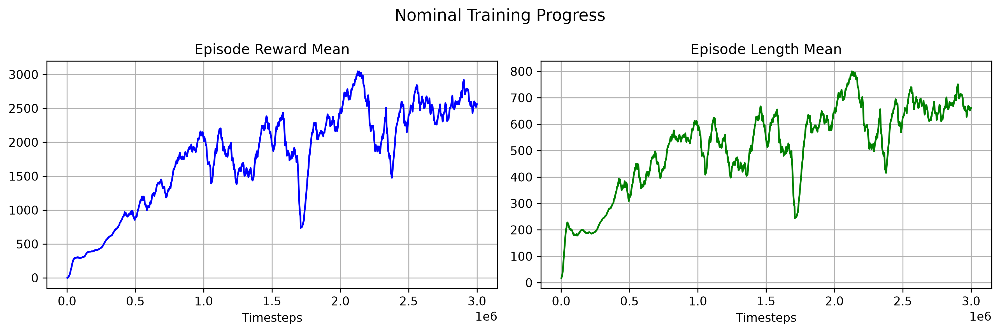
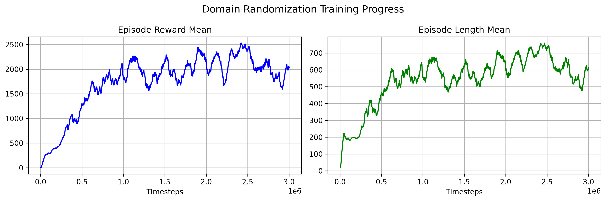
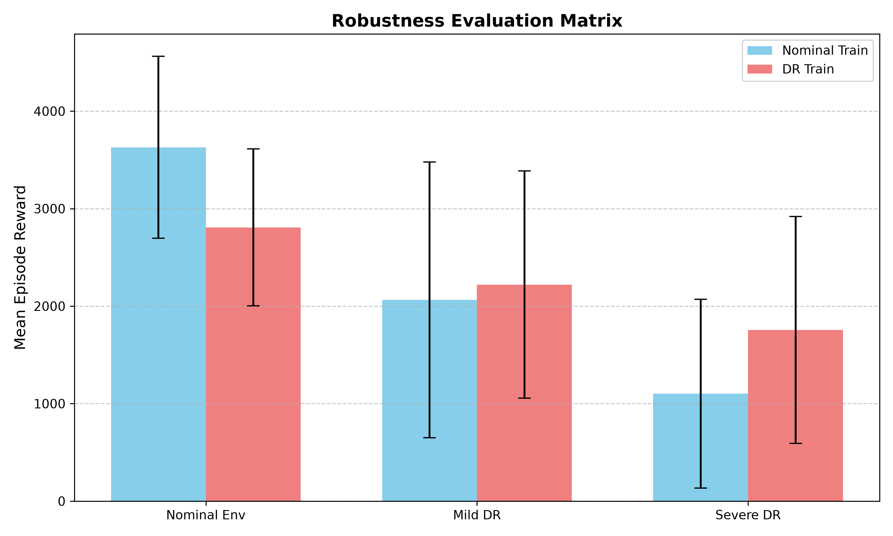
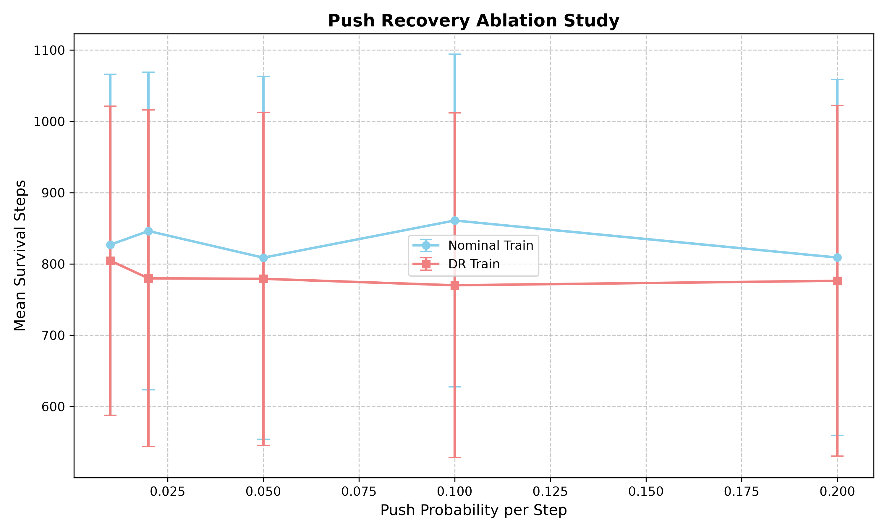

# Empirical Analysis of Parametric Robustness and Dynamic Stability in Domain Randomized Bipedal Locomotion

## Abstract
Sim-to-Real transfer remains a critical challenge in robotic reinforcement learning. In this study, I empirically evaluated the impact of Domain Randomization (DR) on both the parametric robustness and dynamic stability of a PPO agent trained on the MuJoCo `Walker2d-v5` environment. My analysis reveals that while DR successfully mitigates catastrophic performance collapse under out-of-distribution physics, it introduces a measurable "performance penalty" in nominal conditions and fails to grant zero-shot push recovery. These findings suggest that passive parametric randomization is necessary but insufficient for full sim-to-real transfer.

## 1. Introduction
Standard reinforcement learning algorithms often overfit to the exact physics parameters of the simulation environment. When deployed in the real world, minor discrepancies in friction or mass, the "Sim-to-Real gap", can cause policy failure. Domain Randomization (DR) mitigates this by training the agent across a distribution of physical parameters. However, it remains unclear whether this parametric robustness translates to dynamic stability against external disturbances. This study investigates both aspects.

## 2. Methodology
- **Environment & Algorithm:** I utilized `Walker2d-v5` from Gymnasium/MuJoCo and trained a Proximal Policy Optimization (PPO) agent for 3,000,000 timesteps.
- **Domain Randomization:** I implemented a custom Gymnasium wrapper to randomize the floor/foot sliding friction (Uniform[0.4, 1.6]) and torso mass/inertia (Uniform[0.7, 1.3]) at the start of every episode.
- **Evaluation Protocol:** I evaluated both the Nominal-trained and DR-trained models across two axes:
    1. **Parametric Robustness:** A 3x2 evaluation matrix testing performance in Nominal, Mild DR (in-distribution), and Severe DR (out-of-distribution) environments.
    2. **Dynamic Stability:** A zero-shot push recovery ablation study, applying random 50N horizontal forces to the torso at varying probabilities (1% to 20% per step).

## 3. Results & Analysis

### 3.1 Training Dynamics

Both agents successfully learned a dynamic walking gait. The Nominal agent achieved a higher peak reward (~3000) compared to the DR agent (~2500), illustrating the classic "DR Penalty" where optimizing for an average physics distribution sacrifices peak performance in the ideal nominal scenario.

### 3.2 Parametric Robustness

The evaluation matrix reveals the core value of Domain Randomization:
* **The Sim-to-Real Gap:** The Nominal agent suffered a catastrophic 70% performance drop when evaluated in the Severe DR environment (3628 $\rightarrow$ 1101). 
* **DR Mitigation:** The DR agent's performance dropped by only 37% under the exact same severe conditions (2807 $\rightarrow$ 1754). 
* **High Variance:** Both policies exhibited high standard deviations during evaluation. My analysis indicates this is an inherent property of stochastic policy execution in randomized environments, highlighting the need for future evaluations to utilize Standard Error of the Mean (SEM) across multiple seeds.

### 3.3 Dynamic Stability & Push Recovery

To test dynamic stability, I subjected both policies to a zero-shot push recovery sweep. Interestingly, the DR agent did not outperform the Nominal agent. Both policies maintained a mean survival length of roughly 770-860 steps, with nearly identical degradation curves as push probability increased.

This reveals a critical limitation of passive Domain Randomization: **optimizing for parametric robustness does not inherently teach a policy to actively counteract large, sudden external disturbances.** The DR agent learned a conservative gait robust to mass/friction shifts, but lacked the dynamic recovery margin required to absorb physical impacts.

## 4. Discussion
My findings demonstrate that Domain Randomization is highly effective at preventing performance collapse under distributional shift, but it is not a silver bullet for sim-to-real transfer. While it solves the parametric overfitting problem, it fails to address dynamic disturbances. True robustness likely requires combining passive DR with active adversarial training or curriculum learning to explicitly teach disturbance rejection.

## 5. Conclusion
Through this empirical study, I demonstrated the distinct boundaries of Domain Randomization in bipedal locomotion. 